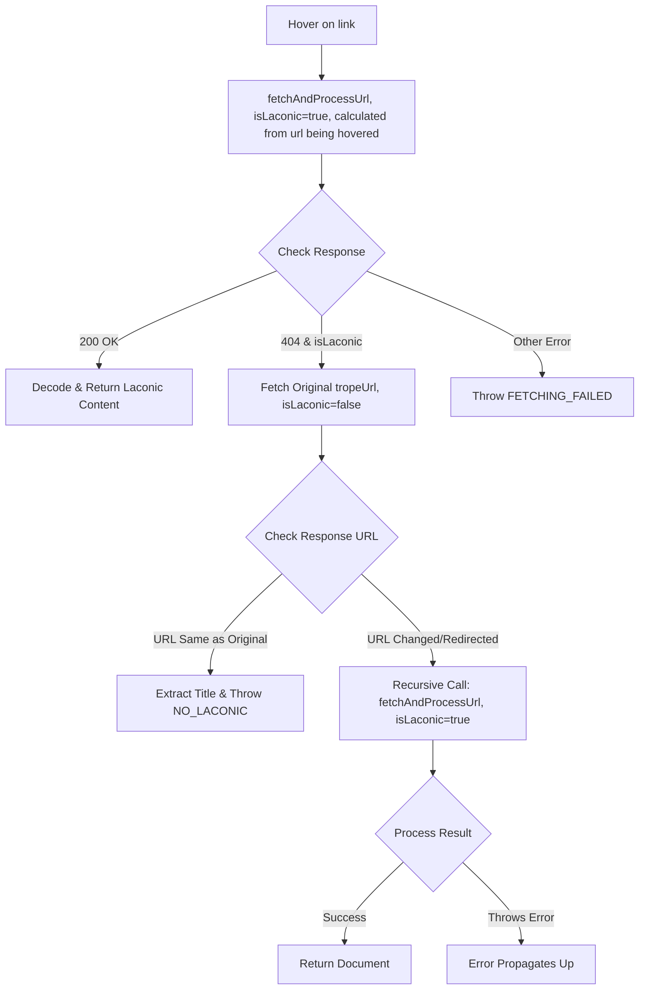

#  Laconic Hover

[link-cws]: https://chrome.google.com/webstore/detail/laconic-hover/ignndocldlheghlflchdbokagecncgmm "Version published on Chrome Web Store"
[link-amo]: https://addons.mozilla.org/en-US/firefox/addon/laconic-hover/ "Version published on Mozilla Add-ons"

> A browser extension which shows Laconic text when hovering on a TV Tropes link.

TV Tropes is great but its even better when you have the power of a million tropes in the palm of your hand.

## Install

- [**Chrome** extension][link-cws] [][link-cws]
- [**Firefox** add-on][link-amo] [][link-amo]

<p align = "left">
    
</p>

## How?

This used to be a Userscript but its become more of a fully fledged extension. The core of this extension works by fetching "laconic pages" in the TV Tropes wiki. These are ["subpages ... for brief statements describing the core idea of the page they are attached to."](https://tvtropes.org/pmwiki/pmwiki.php/Main/LaconicWiki) Thankfully many pages have them and they're very helpful for navigating if you don't know every Trope off by heart. This extension attempts to make a request to the laconic page of any Trope link you happen to be hovering on. If a Laconic page exists, the html is displayed, otherwise an error message is displayed.

This extension uses [tippy.js](https://atomiks.github.io/tippyjs/) for controlling and displaying hovering elements, which is super neat!

## Hasn't this been done before?

Yes, I think so:
\[[1](http://userscripts-mirror.org/scripts/show/130346)]
\[[2](https://chrome.google.com/webstore/detail/tropes-helper-beta/nbmecnaokkbfonmbplonmnekhiklkjlm)]  
But neither were ever updated, hopefully this will be different.

## Development

See the npm scripts for more information. To get started make sure [Node.js®](https://nodejs.org/en/) is installed. You can then clone the repo and install the repositories:

```shell
git clone https://github.com/spoookyuser/laconic_hover
cd laconic_hover
pnpm install
```

If you want to play around with the project do the following:

`pnpm run dev`

## Algorithm



## Roadmap

I don't have any feature ideas at the moment, so please [click here](https://github.com/spoookyuser/laconic_hover/issues/new) to submit any ideas you might have.

## Contributing

Please see [contributing.md](contributing.md). TL;DR: All are very welcome.

## Acknowledgements

- [lamp by Sandra Mills from the Noun Project](https://thenounproject.com/search/?q=lamp+shade&i=121407)
